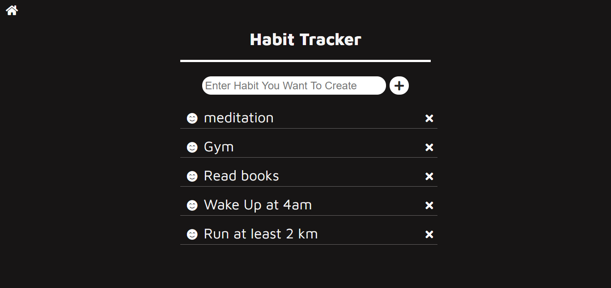
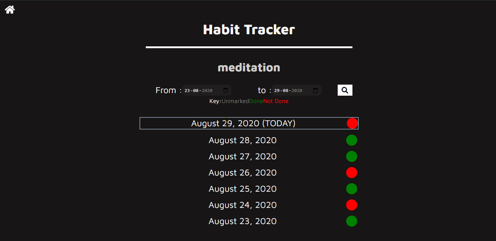

# Habit-Tracker
You cannot able to keep your habit or want to create new habit.
Then try this amazing app Habit Tracker

A basic Habit Tracking System. Tech Stack : HTML, CSS, JS, Node.js

### Home :



### Habit :



## Technology Stack
- EJS
- SCSS
- NodeJS
- Express

## How-To-Use

- Clone this project
- Start by installing npm and mongoDB if you don't have them already.
- Run the Mongo Server.
- Navigate to Project Directory
    ```
    cd Habit-Tracker
    ```
- run following commands :
    ```
    npm install 
    ```
    ```
    npm start
    ```
## Basic-Features
- Home page includes all the habits you have added. You can Add or Delete any habit from here.
- Habits page here you can mark a particular habit for a date marked or not here you can also search by dates.
   
## Directory Structure and flow of The Code
This code follows MVC pattern and hence everything is differentiated and well managed:

    Habit_tracker
        |-----assets
        |       |--- css
        |       |     |-- habit.css
        |       |     |-- home.css
        |       |     └-- layout.css
        |       |--- js
        |       |     |-- habit.js
        |       |     └-- moment.js
        |       |--- sass
        |             |-- habit.scss
        |             |-- home.scss
        |             └-- layout.scss
        |------ config
        |         └--- mongoose.js
        |------ controllers
        |         └--- habit_controllers.js
        |------ models
        |         └--- habit.js
        |------ routers
        |         └--- index.js
        |------ views
        |         |--- habit..ejs
        |         |--- home.ejs
        |         └--- layout.ejs
        |------ .gitignore
        |------ app.js
        |------ package.json
        |------ package-lock.json
        └------ README.md

Happy Coding :)
